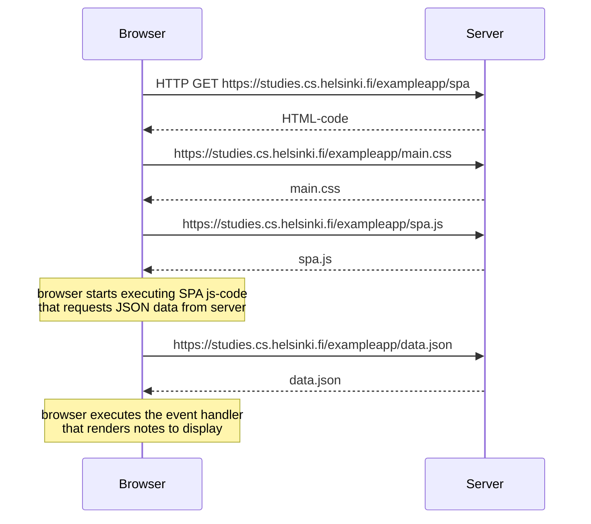

```mermaid
sequenceDiagram
Browser->>Server: HTTP GET https://studies.cs.helsinki.fi/exampleapp/spa
Server-->>Browser: HTML-code
Browser->>Server: https://studies.cs.helsinki.fi/exampleapp/main.css
Server-->>Browser: main.css
Browser->>Server: https://studies.cs.helsinki.fi/exampleapp/spa.js
Server-->>Browser: spa.js
Note over Browser: browser starts executing SPA js-code <br/> that requests JSON data from server 
Browser->>Server: https://studies.cs.helsinki.fi/exampleapp/data.json
Server-->>Browser: data.json
Note over Browser: browser executes the event handler<br/>that renders notes to display
```
