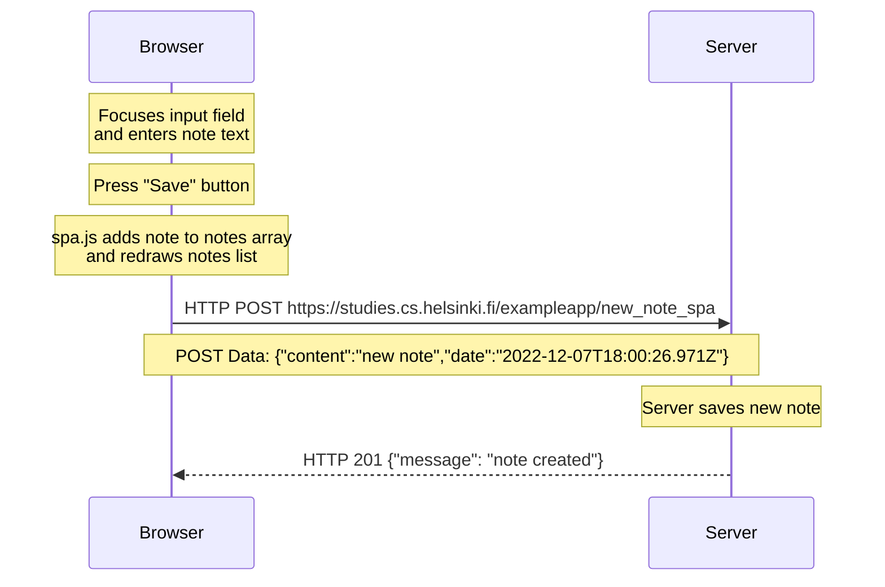

```mermaid
sequenceDiagram
participant Browser
Note over Browser: Focuses input field <br> and enters note text
Note over Browser: Press "Save" button
Note over Browser: spa.js adds note to notes array <br> and redraws notes list
Browser->>Server: HTTP POST https://studies.cs.helsinki.fi/exampleapp/new_note_spa
Note over Browser,Server: POST Data: {"content":"new note","date":"2022-12-07T18:00:26.971Z"}
Note over Server: Server saves new note
Server-->>Browser: HTTP 201 {"message": "note created"}
```